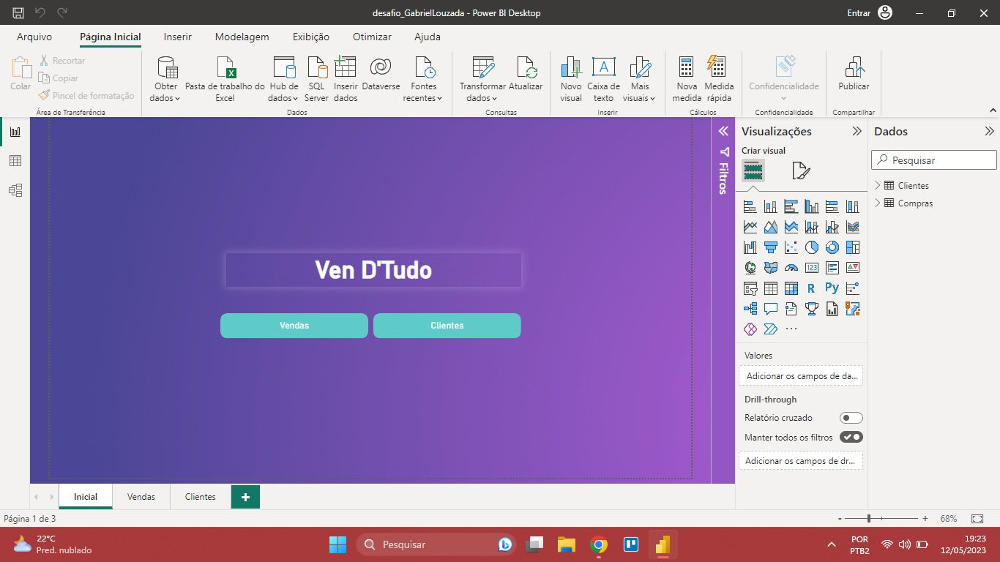
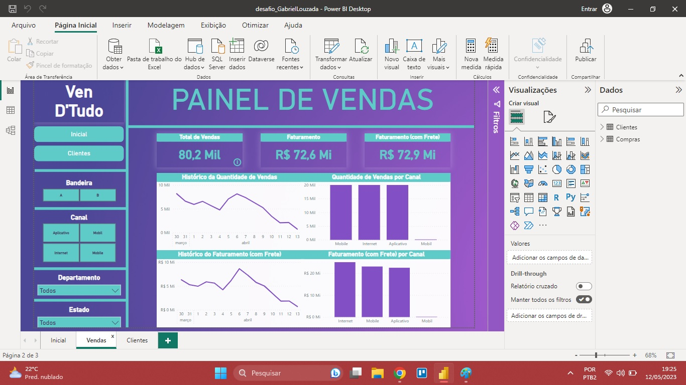
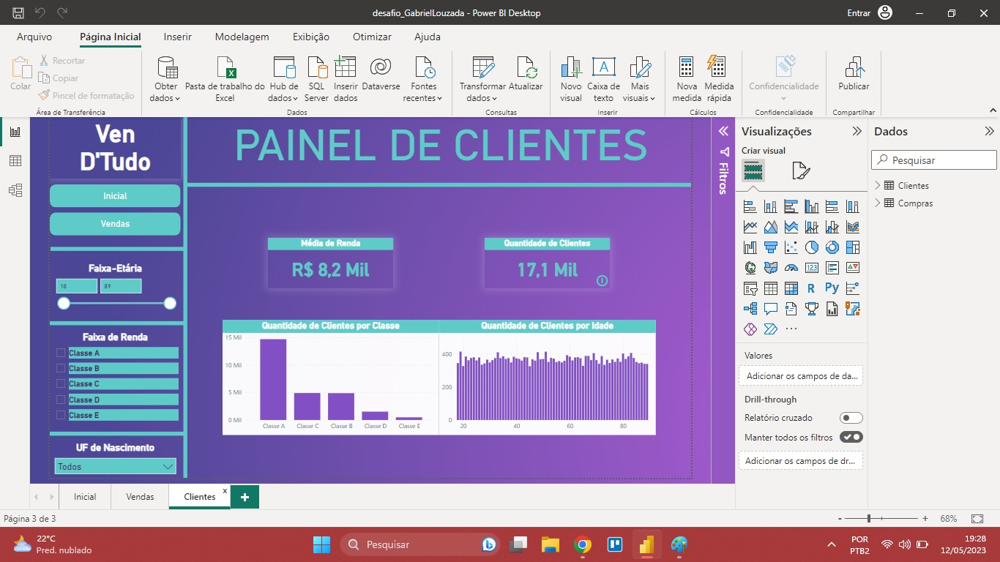

If you want to read this file in English, click [here](README_ENG.md).

# 🇧🇷/🇵🇹:

❇️ Os arquivos deste repositório são as versões finais e corrigidas dos Desafios pelos quais passei durante a Formação em Dados para conclusão do curso.

## ✴️ Desafio 1: Preveja os resultados de um e-commerce utilizando o Power BI.
  
### Contexto e Desafio:
> Neste desafio, você deverá construir um painel gerencial para um e-commerce que almeja estudar as suas vendas e, assim, traçar a melhor estratégia para alavancar seus resultados. Você receberá duas bases de dados: uma com dados das vendas e outra com informações dos clientes. Com isso, crie duas páginas para que os analistas possam visualizar as métricas.
### Requerimento de Visuais:
+ Card de Quantidade de Vendas;
+ Card com Valor de Vendas s/ Frete;
+ Card com Valor de Vendas c/ Frete;
+ Card com Quantidade de Clientes;
+ Card com Renda Média dos Clientes;
+ Gráfico de Linha com Quantidade de Vendas por Mês;
+ Gráfico de Linha com Valor Total de Vendas por Mês;
+ Gráfico de Barras com Quantidade de Vendas por Categoria;
+ Gráfico de Barras com Valor Total de Vendas por Categoria;
+ Gráfico de Barras com Distribuição de Idade dos Clientes;
+ Gráfico de Barras com Distribuição de Renda dos Clientes;
+ Segmentação de Dados por Bandeira;
+ Segmentação de Dados por Estado;
+ Segmentação de Dados por Canal de Venda;
+ Segmentação de Dados por Departamento;
+ Segmentação de Dados por Idade;
+ Segmentação de Dados por Faixa de Renda;
+ Segmentação de Dados por Estado de Nascimento.
### Final:
- `desafio1_dashboard.pbix` > Dashboard final criado no desafio;
- `desafio1_dataset.xlsx` > Base de dados utilizada;
- **Nota:** 100
- **Certificação:** Introdução a Modelo de Regressão Linear.

## ✴️ Desafio 2: Crie um painel gerencial automatizado utilizando Power BI.
- `desafio2_dashboard.pbix` > Dashboard final criado no desafio;
- `desafio2_dataset.xlsx` > Base de dados utilizada;
- **Nota:** 100
- **Certificação:** Análise de Dados com Excel e Power BI.
