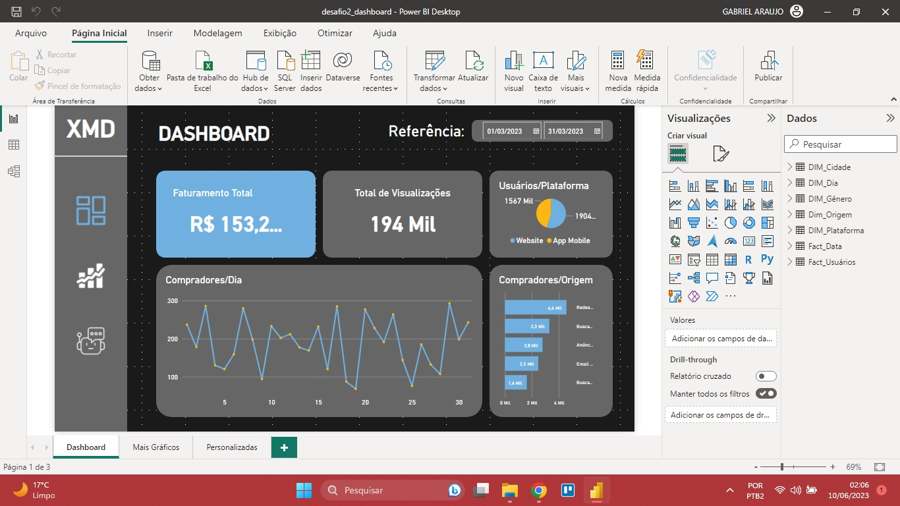
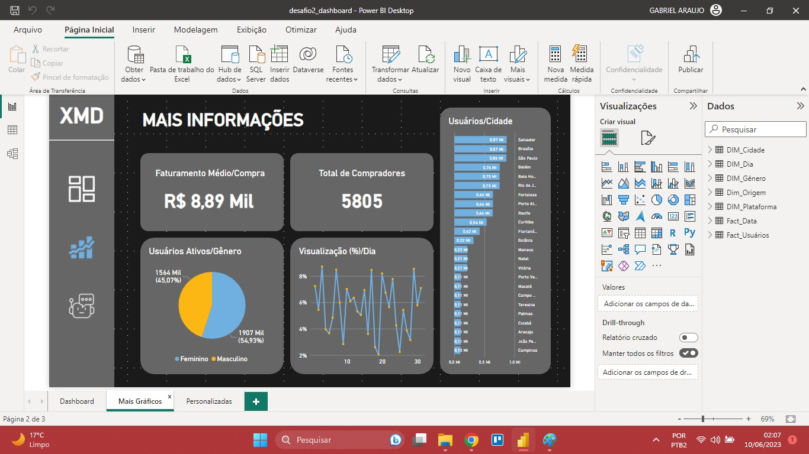
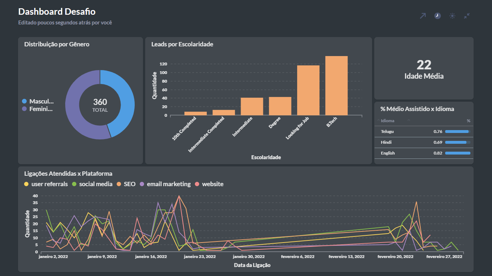

If you want to read this file in English, click [here](README_ENG.md).

# 🇧🇷/🇵🇹:

❇️ Os arquivos deste repositório são as versões finais e corrigidas dos Desafios pelos quais passei durante a Formação em Dados para conclusão do curso.

## ✴️ Desafio 1: Preveja os resultados de um e-commerce utilizando o Power BI.
  
### Contexto e Desafio:
> Neste desafio, você deverá construir um painel gerencial para um e-commerce que almeja estudar as suas vendas e, assim, traçar a melhor estratégia para alavancar seus resultados. Você receberá duas bases de dados: uma com dados das vendas e outra com informações dos clientes. Com isso, crie duas páginas para que os analistas possam visualizar as métricas.
### Requerimento de Visuais:
+ Card com Quantidade de Vendas;
+ Card com Valor de Vendas s/ Frete;
+ Card com Valor de Vendas c/ Frete;
+ Card com Quantidade de Clientes;
+ Card com Renda Média dos Clientes;
+ Gráfico de Linha com Quantidade de Vendas por Mês;
+ Gráfico de Linha com Valor Total de Vendas por Mês;
+ Gráfico de Barras com Quantidade de Vendas por Categoria;
+ Gráfico de Barras com Valor Total de Vendas por Categoria;
+ Gráfico de Barras com Distribuição de Idade dos Clientes;
+ Gráfico de Barras com Distribuição de Renda dos Clientes;
+ Segmentação de Dados por Bandeira;
+ Segmentação de Dados por Estado;
+ Segmentação de Dados por Canal de Venda;
+ Segmentação de Dados por Departamento;
+ Segmentação de Dados por Idade;
+ Segmentação de Dados por Faixa de Renda;
+ Segmentação de Dados por Estado de Nascimento.
### Final:
- `desafio1_dashboard.pbix` > Dashboard final criado no desafio;
- `desafio1_dataset.xlsx` > Base de dados utilizada;
- **Nota:** 100
- **Certificação:** Introdução a Modelo de Regressão Linear.

## ✴️ Desafio 2: Crie um painel gerencial automatizado utilizando Power BI.
 
### Contexto e Desafio:
> A empresa de Marketing Digital "X" precisa atingir uma meta ambiciosa neste trimestre e precisa identificar os melhores planos de ação para alcançá-la. Para isso, ela decidiu criar um dashboard no Power BI que permita acompanhar os principais indicadores de desempenho. Com esses dados, a equipe poderá avaliar o desempenho de cada campanha, identificar oportunidades de otimização e escolher os melhores planos de ação para alcançar a meta do quarter. O dashboard será uma ferramenta essencial para a tomada de decisão mais informada e estratégica. (Todos do mês de março).
### Requerimento de Visuais:
+ Card com Receita Total;
+ Card com Receira Média por Compra;
+ Card com Visualizações na Página;
+ Gráfico de Pizza com Usuários Ativos por Gênero;
+ Gráfico de Pizza com Usuários Ativos por Plataforma;
+ Gráfico de Barras com Número de Compradores por Origem;
+ Gráfico de Barras com Número de Usuários por Cidade;
+ Gráfico de Linha com Número de Compradores por Data;
+ Gráfico de Linha com Percentual de Visualização por Data;
+ Segmentação de Dados por Data.
### Final:
- `desafio2_dashboard.pbix` > Dashboard final criado no desafio;
- `desafio2_dataset.xlsx` > Base de dados utilizada;
- **Nota:** 100
- **Certificação:** Análise de Dados com Excel e Power BI.

## ✴️ Desafio 3: Gere planos de ação a partir de análises com SQL.

### Contexto e Desafio:
> Suponha que você seja um analista de dados em uma empresa Edtech. Sua empresa está focada em acelerar seu crescimento aumentando o número de usuários cadastrados. Portanto, você foi solicitado a analisar vários aspectos da aquisição de clientes para ver o status do crescimento de novos usuários em sua empresa. Você construirá um dashboard utilizando SQL em busca de definir os próximos passos. Deverá utilizar as informações para estabelecer a estratégia da empresa para o próximo ano.
### Visualizações e Queries:
1. Distribuição por Gênero;
2. Leads por Escolaridade;
3. Idade Média;
4. % Médio Assitido por Idioma;
5. Ligações Atendidas por Plataforma.
### Final:
- `desafio3_presentation.pdf` > Apresentação com o dashboards e queries;
- **Nota:** 100
- **Certificação:** SQL para Análise de Dados.
